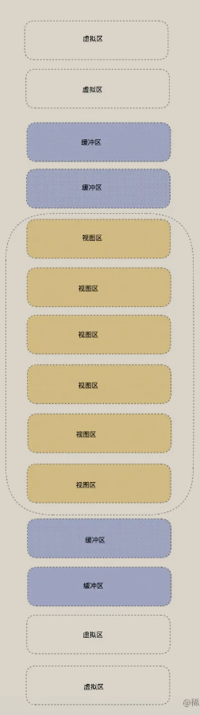

#### 时间分片

- 浏览器执行js速度远远大于渲染DOM速度,时间分片将一次性任务分割开来,给人一种流畅的体验

#### 虚拟列表

- 长列表滚动，只有视图区域显示真实DOM
- 分为：视图区 + 缓冲区 + 虚拟区
  

  - 视图区就是当前可见区域，渲染真实DOM
  - 缓冲区是为了滑动时避免出现白屏的情况，也是真实DOM
  - 虚拟区，不需要真实DOM渲染

- 实现思路
  - 计算初始容器高度，截取初始化列表长度，注意需要div占位以撑起滚动条
  - 通过监听onScroll事件，计算渲染区域向上偏移量
  - 通过重新计算开始和结束位置来重新渲染列表

