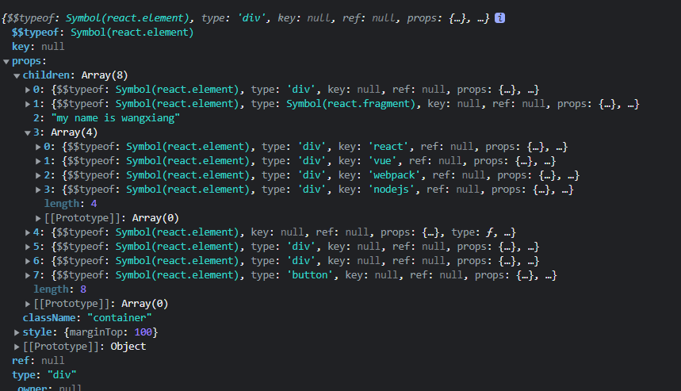
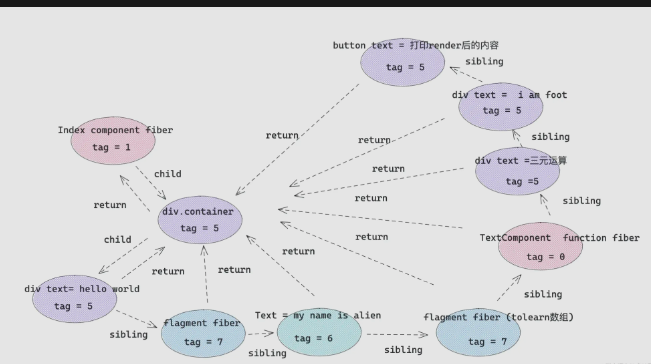

#### JSX

##### 最终结果

- 了解常用的元素会被 React 处理成什么,有利于后续理解 react fiber 类型
- 理解 jsx 的编译过程,方便操纵 children,控制 React 渲染,有利于便捷使用 React 插槽组件

以代码中的 jsx 片段为例

- babel 处理 jsx 后编译结果如下
  
  因为 jsx 最终编译为 React.createElement,老版本 React 需要写 jsx 组件时需要默认引入 React

- React.createElemet 处理后的样子
  
  jsx 元素类型 react.createElement 转换后 type 属性
  |jsx 元素类型|react.createElement 转换后|type 属性|
  |--|--|--|
  |element 元素类型|react element 类型|标签字符串，例如 div span 等|
  |fragment 类型|react element 类型|symbol react.fragment 类型|
  |文本类型|直接字符串|无|
  |数组类型|返回数组结构，里面元素被 react.createElement 转换|无|
  |组件类型|react element 类型|组件类或组件函数本身|
  |三元运算/表达式|先执行三元运算，然后按照上述处理规则|三元运算结果定|
  |函数执行|先执行函数，然后按照上述处理规则|函数执行结果定|

- React 底层调和处理后的样子
  上述 react.element 对象的每一个节点都会生成一个对应的 fiber 对象,通过 return,child,sibling 进行关联

  React 针对不同的 React element 对象会产生不同的 tag（种类）的 fiber 对象

  ```tsx
  export const FunctionComponent = 0; // 函数组件
  export const ClassComponent = 1; // 类组件
  export const IndeterminateComponent = 2; // 初始化的时候不知道是函数组件还是类组件
  export const HostRoot = 3; // Root Fiber 可以理解为根元素 ， 通过reactDom.render()产生的根元素
  export const HostPortal = 4; // 对应  ReactDOM.createPortal 产生的 Portal
  export const HostComponent = 5; // dom 元素 比如 <div>
  export const HostText = 6; // 文本节点
  export const Fragment = 7; // 对应 <React.Fragment>
  export const Mode = 8; // 对应 <React.StrictMode>
  export const ContextConsumer = 9; // 对应 <Context.Consumer>
  export const ContextProvider = 10; // 对应 <Context.Provider>
  export const ForwardRef = 11; // 对应 React.ForwardRef
  export const Profiler = 12; // 对应 <Profiler/ >
  export const SuspenseComponent = 13; // 对应 <Suspense>
  export const MemoComponent = 14; // 对应 React.memo 返回的组件
  ```

- jsx 最终形成的 fiber 结构图
  

-

##### 可控性 render

加深对 jsx 编译后结构的认知,学会对 jsx 编译后的 ReactElement 进行一些列操作,达到理想化的结果,熟悉 React API 的使用

- 需求:可控性 render
- 问题
  1. 上述 children 节点包含 reactElement 元素类型,文本类型,数组类型,组件类型等
  2. 无法对 render 后的 react element 元素进行可控性操作
- 解决
  1. 拍平 children，将数组类型的子节点打开
  2. 干掉 children 中文本类型节点
  3. 向 children 最后添加 say goodbay 元素
  4. 克隆新的元素节点并渲染

##### Babel解析JSX流程
