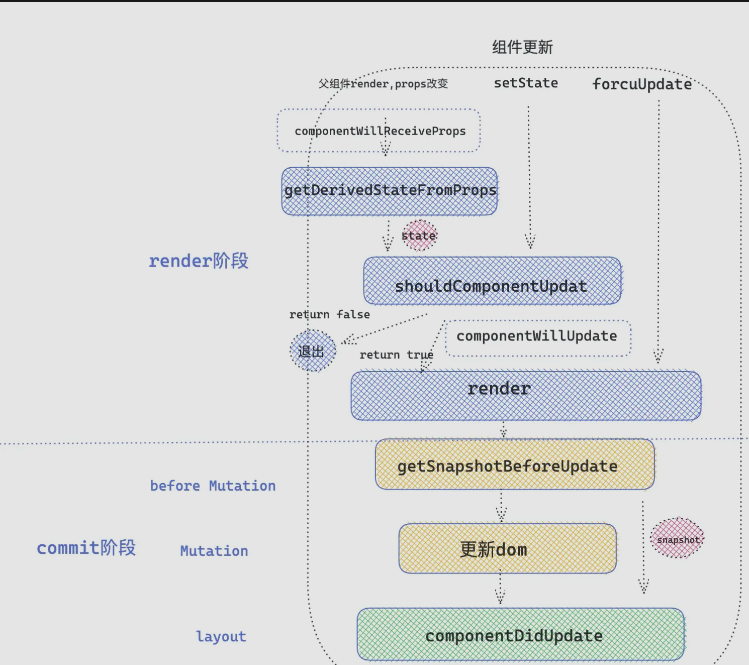

#### 生命周期

##### React 阶段

- render（调和）阶段
  在调和阶段从 fiber root 的 fiber 节点深度遍历 fiber 树，找不同，对于变化组件执行 render 函数
- commit 阶段
  调和结束，进入 commit 阶段，渲染真实 DOM

##### 类组件调和阶段

- 当 fiber tag = 1 时，按照类组件的处理逻辑

  ```js
  // react-reconciler/src/ReactFiberBeginWork.js
  // workloop React处理类组件的主要功能方法
  function updateClassComponent() {
    let showldUpdate;
    const instance = workInProgress.stateNode; // stateNode时fiber节点指向 类组件实例 的指针
    if (instance === null) {
      // 发现组件实例不存在，证明组件实例没有被挂载过，走初始化流程
      constructClassInstance(workInProgress, Component, nextProps); // 此方法中new组件实例
      mountClassInstance(
        workInProgress,
        Component,
        nextProps,
        renderExpirationTime
      ); // 初始化挂载组件流程
      shouldUpdate = true; // shouldUpdate标识用来证明组件是否需要更新
    } else {
      shouldUpdate = updateClassInstance(
        current,
        workInProgress,
        Component,
        nextProps,
        renderExpirationTime
      ); // 更新组件流程
    }

    if (shouldUpdate) {
      nextChildren = intance.render(); // 执行render函数
      reconcileChildren(
        current,
        workInProgress,
        nextChildren,
        renderExpirationTime // expiration /ekspəˈreIʃ(ə)n/ 到期
      ); // 继续调和子节点
    }
  }
  ```

  - instance 类组件对应实例
  - workInProgress 树，当前正在调和的 fiber 树，一次更新中，React 自上向下深度遍历子代 fiber，如果遍历到一个 fiber，会把当前 fiber 指向 workInProgress
  - current 树，初始化时 current= null，在一次 fiber 调和后，会将 workInProgress 树赋值给 current 树，React 来用 workInProgress 和 current 来确保一次更新中，快速构建并且状态不会丢失
  - Component 项目中的 class 组件
  - nextProps 作为组件在一次更新中新的 props
  - renderExpirationTime 作为下一次渲染的过期时间

- fiber 节点和组件实例关系
  `fiber.stateNode = class instance`
  `class instance._reactInternals = fiber`

##### React 类组件生命周期

**初始化阶段 mount**

1. 执行 constructor

   - 执行 constructor，通过调用 constructorClassInstance 函数实例化 React 组件
   - 实例化完成，通过调用 mountClassInstance 来初始化组件

     ```js
     // react/react-reconciler/src/ReactFiberClassComponent.js
     function mountClassIntance(
       workInProgress,
       ctor,
       newProps,
       renderExpirationTime
     ) {
       const instance = workInProgress.stateNode;
       // get derived/dI'raIvd/(导出的、派生的) stateFromProps
       const getDerivedStateFromProps = ctor.getDerivedStateFromProps; // ctor是对应的类组件，获取类组件的实例方法
       if (typeof getDerivedStateFromProps === "function") {
         const partialState = getDericedStateFromProps(nextProps, prevState); // partial /ˈpɑːʃ(ə)l/部分的 执行getDerivedStateFromProps方法，得到合并的state
         const memoizedState =
           partialState === null || partialState === undefined
             ? prevState
             : Object.assign({}, prevState, partialState); // 合并state
         workInProgress.memoizedState = memoizedState; // memorized /meməraIzd/
         instance.state =
           workInProgress.memoizedState; /* 将state 赋值给我们实例上，instance.state  就是我们在组件中 this.state获取的state*/
       }

       if (
         typeof ctor.getDerivedStateFromProps !== "function" &&
         typeof instance.getSnapshotBeforeUpdate !== "function" && // snapshot 快照
         typeof instance.componentWillMount === "function"
       ) {
         instance.componentWillMount(); /* 当 getDerivedStateFromProps 和 getSnapshotBeforeUpdate 不存在的时候 ，执行 componentWillMount*/
       }
     }
     ```

2. getDrivedStateFromProps 是第二个要执行的生命周期，他是从 ctor 类上直接绑定的静态方法，传入 props 和 state，返回值和之前的 state 合并，作为新的 state 传递给组件实例
3. componentWillUpdate 如果存在 getDerivedStateFromProps 和 getSnapshowBeforeUpdate 时不执行
4. mountClassInsatance 函数执行完成，但是 updateClassComponent 执行完成后会执行 render 函数
5. 执行 render 函数，形成 children，接着调用 reconcileChildren 方法深度调和 children，到此 render 阶段结束
6. 组件初始化 commit 阶段，执行 componentDidMount 生命周期

```js
// react-reconciler/src/ReactFiberCommitWork.js
function commitLifeCycles(finishedRoot, current, finishedWork) {
  switch (finishWork.tag) {
    case ClassComponent: {
      const instance = finishedWork.stateNode;
      if (current === null) {
        /* 类组件第一次调和渲染 */
        instance.componentDidMount();
      } else {
        /* 类组件更新 */
        intance.componentDidUpdate(
          prevProps,
          prevState,
          instance._reactInternalSnapshotBeforeUpdate
        );
      }
    }
  }
}
```

由此可见，componentDidMount 与 componentDidUpdate 生命周期执行时机相同
执行顺序：construcotr -> getDerivedStateFromProps/componentWillUpdate -> render -> componentDidMount

**更新阶段 update**

回到最初执行 updateClassComponent 的地方，当 current 不为 null 时，进入更新阶段

```js
// react-reconciler/src/ReactFiberClassComponent.js
// instance 类组件对应实例
// workInProgress 树，当前正在调和的 fiber 树，一次更新中，React 自上向下深度遍历子代 fiber，如果遍历到一个 fiber，会把当前 fiber 指向 workInProgress
// current 树，初始化时 current= null，在一次 fiber 调和后，会将 workInProgress 树赋值给 current 树，React 来用 workInProgress 和 current 来确保一次更新中，快速构建并且状态不会丢失
// ctor 即Component 项目中的 class 组件
// nextProps 作为组件在一次更新中新的 props
// renderExpirationTime 作为下一次渲染的过期时间
function updateClassComponent(
  current,
  workInProgress,
  ctor,
  newProps,
  renderExpirationTime
) {
  const intsance = workInProgress.stateNode; // 类组件实例
  const hasNewLiftCycles = typeof ctor.getDerivedStateFromProps === "function"; // 判断是否具有getDerivedStateFromProps生命周期
  if (
    !hasNewLifeCycles &&
    typeof instance.componentWillReceiveProps === "function"
  ) {
    if (oldProps !== newProps || oldContext !== nextContext) {
      // 浅比较
      intance.componentWillReceiveProps(newProps, nextContext); // 执行componentWillReceiveProps生命周期
    }
  }
  let newState = (instance.state = oldState);
  if (typeof getDerivedStateFromProps === "function") {
    ctor.getDerivedStateFromProps(nextProps, prevState); // 执行生命周期函数getDerivedStateFromProps 逻辑类似mount合并state
    newState = workInProgress.memoizedState;
  }

  let shouldUpdate = true;
  if (typeof instance.shouldComponentUpdate === "function") {
    // 执行生命周期函数shouldComponentUpdate，返回值决定是否执行render，调和子节点
    shouldUpdate = instance.shouldComponentUpdate(
      newProps,
      newState,
      newContext
    );
  }
  if (shouldUpdate) {
    if (typeof instance.componentWillUpdate === "function") {
      instance.componentwillUpdate();
    }
  }

  return shouldUpdate;
}
```

1. 执行生命周期 componentWillReceiveProps
   getDerivedStateFromProps 不存在时执行 componentWIllReceiveProps
2. 执行生命周期 getDerivedStateFromProps 返回值用于合并 satte，生成新的 state
3. 执行生命周期 shouldComponentUpdate 决定是否执行 render 函数，调和子节点
4. 执行生命周期 componentWillUpdate
   此时 UpdateClassInstance 方法到此执行完毕
5. 执行 render 函数，得到最新的 React element 元素，继续调和子节点
6. 执行 getSnapshotBeforeUpdate
   ```js
   // react-reconciler/src/ReactFiberCommitWork.js
   function commitBeforeMutationLifeCycles(current, finishedWork) {
     switch (finishedWork.tag) {
       class ClassComponent: {
         conse snapshoy = instance.getSnapshotBeforeUpdate(prevProps, prevState)/* 执行生命周期 getSnapshotBeforeUpdate   */
         instance.__reactInternalSnapshotBeforeUpdate = snapshot; // 返回值作为__reactInternalSnapshotBeforeUpdate 传递给componentDidUpdate生命周期
       }
     }
   }
   ```
   getSnapshotBeforeUpdate 执行也在 commit 阶段
   commit 阶段分为三个阶段，分别：
   before Mutation(DOM 修改前)
   Mutation(DOM 修改)
   Layout(DOM 修改后)
   getSnapshotBeforeUpdate 发生在 before Mutation 阶段，生命周期的返回值将传递给 commitDidUpdate
7. 执行 componentDidUpdate 函数
   此时 DOM 修改完成，可以操作修改后的 DOM，到此更新阶段的生命周期执行完毕
   
   执行顺序：componentWillReceiveProps / getDerivedStateFromProps -> shouldComponentUpdate -> componentWillUpdate -> render -> getSnapshotBeforeUpdate -> componentDidUpdate
   **销毁节点**

```js
// react-reconciler/src/ReactFiberCommitWork.js
function callComponentWillUnmountWithTimer() {
  instance.componentWillUnmount();
}
```

在一次调和更新后，发生元素被移除，就会打对应的 Deletion 标签，然后再 commit 阶段调用 componentWillUnmount 生命周期，接下来统一卸载组件及 DOM 元素

##### React 各阶段生命周期做什么

1. constructor 阶段
   类组件创建实例时调用，初始化执行一次，主要做一些初始化工作
   ```js
   constructor (props) {
     super(props) // 执行super，执行基类Component方法 绑定props 初始化ref等
     this.state = { // 初始化state
       name: 'sf'
     }
     this.handleClick = this.handleClick.bind(this) // 绑定this
     this.handleInputChange = debounce(this.handleInputChange, 500) // 绑定防抖函数
     this.render = function () {
       return _render.bind(this) // 劫持修改类组件的一些生命周期方法
     }
   }
   ```
2. getDerivedStateFromProps 阶段：得到派生的 state 从 props 中
   初始化和更新阶段，接收父组件的 props 数据，可以对 props 进行格式化、过滤等操作，返回值将作为新的 state 合并到 state 中，供给视图渲染层消费
   类的静态属性方法，内部获取不到 this，用于取缔 componentWillMount 和 componentWillReviveProps
   只要组件更新（props 改变、setState、forceUpdate)，就会执行
   ```jsx
   static getDerivedStateFromProps (newProps) {
     const { type } = newProps;
     switch (type) {
       case: 'fruit'
        return { list: ['苹果', '梨', '葡萄'] } // 接收props变化，返回值作为新的state，用于渲染或传递给shouldComponentUpdate方法
     }
   }
   render () {
     return <div>{ this.state.list.map(item => <li key={item}>{item}</li>) }</div>
   }
   ```
   作用：
   1. 代替 componentWillMount 和 componentWillReceiveProps
   2. 组件醋和石化或更新时，将 props 映射到 state
   3. 返回值与 state 合并，可以作为 shouldComponentUpdate 第二个参数 newState
3. componentWillMount 和 UNSAFE_componentWillMount
   16.3 版本开始 componentWillMount、ComponentWillReceiveProps 和 componentWillUpdate 三个生命周期加上了 UNSAFE 标志
   原因：这些生命周期都是在 rende 日之前执行，没有条件制约。可能会执行多次 updateClassInsatnce 方法
4. componentWillReveiveProps 和 UNSAFE_componentWillReveiceProps
   主要父组件执行 render 函数，props 会被重建，此时会执行 componentWillReceiveProps，所以即使 props 没变，该生命周期也会执行

   可以用来监听父组件是否执行 render
   可以访问 this，这是 getDerivedStateFromProps 不能实现的

   pureComponent 组件不能阻止 componentWillReceiveProps 的执行，纯组件是在 componentWillReceiveProps 执行之后浅比较 props 是否发生变化

5. componentWillUpdate 和 UNSAFE_componentWillUpdate
   DOM 更新之前执行，可以获取组件更新之前的状态，比如 DOM 元素位置
   使用 getSnapshotBeforeUpdate 生命周期代替
6. render
   render 函数就是 jsx 的各个元素被 React.createElement 创建成 react element 对象的形式
   render 过程就是创建 React.element 元素的过程，可以做一些 createElement、cloneElemenet、React.children 遍历 Children 的操作
7. getSnapshotBeforeUpdate
   获取更新前的快照，获取更新前 DOM 的状态，在 commit 阶段的 before Mutation 阶段执行，此时 DOM 未更新，在接下来的 MUtation 中替换真实 DOM，需要返回一个值作为 snapShot，传递给 componentDidUpdate 作为第三个参数
   ```js
   getSnapshotBeforeUpdate(prevProps,preState){
    const style = getComputedStyle(this.node)
    return { /* 传递更新前的元素位置 */
        cx:style.cx,
        cy:style.cy
    }
   }
   componentDidUpdate(prevProps, prevState, snapshot){
    /* 获取元素绘制之前的位置 */
    console.log(snapshot)
   }
   ```
8. componentDidUpdat
   ```js
   // prevProps 更新前的props
   // prevState 更新前的State
   // snapshot getSnapshotBeforeUpdate返回的快照
   componentDidUpdate(prevProps, prevState, snapshot){
    const style = getComputedStyle(this.node)
    const newPosition = { /* 获取元素最新位置信息 */
        cx:style.cx,
        cy:style.cy
    }
   }
   ```
   DOM 更新完成，可以获取 DOM 最新状态
   使用 setState 要加限制，否则会无限循环
9. componentDidMount
   与 compoentDidUpdate 类似，可以做一些基于 DOM 的操作
10. shouldComponentUpdate
    用于性能优化，返回值决定是否重新渲染类组件
11. componentWillUnmount
    组件销毁阶段唯一执行的生命周期

##### 函数组件替代方案

1. useEffect
   React 处理逻辑采用异步调用，对于每一个 effect 的 callback，React 会向 setTimeout 回调函数一样，放入任务队列，等主线程执行完成，DOM 更新，js 执行完成，视图绘制完毕后才执行
   因此，effect 回调函数不会阻塞浏览器绘制视图
2. useLayoutEffect
   采用同步执行
   DOM 更新之后，浏览器绘制之前执行，方便修改 DOM
   如果修改 DOM 操作放在 useEffect 中，会导致浏览器绘制视图之后又修改 DOM，导致浏览器再次回流和重绘

   usLayoutEffect callback 代码执行会阻塞浏览器绘制

3. 使用规则
   修改 DOM，改变布局用 useLayoutEffect，其他情况用 useEffect
4. componentDidMount/componentDidUpdate 与 useEffect 区别
   useEffect 异步执行，而 componentDidMount/componentDidUpdate 时同步执行的，在时机上类似 useLayoutEffect
5. useInsertionEffect

   ```js
   React.useEffect(() => {
     console.log("useEffect 执行");
   }, []);

   React.useLayoutEffect(() => {
     console.log("useLayoutEffect 执行");
   }, []);

   React.useInsertionEffect(() => {
     console.log("useInsertionEffect 执行");
   }, []);
   ```
  useInsertionEffect比useLayoutEffect执行提前，是在DOM还没有更新的时候执行