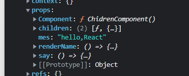

#### Props

##### Props 是什么

- 类型

1. props 作为一个子组件渲染数据源
2. props 作为一个通知父组件的回调函数
3. props 作为一个单纯的组件传递
4. props 作为渲染函数
5. render props 和 4 的区别时放在 children 属性上
6. render component 插槽组件

- props 在组件实例上的展示形式
  通过 this.props 访问如下: 标签里的属性会被绑定到 props 对象上, 而组件的插槽会被绑定到 props 的 Children 属性上
  

##### React 如何定义 props

- 作为 React 组件层级 props 充当的角色

1. 作为数据传递给子组件进行渲染
2. 作为 callback 函数向父组件传递信息
3. 将视图容器作为 props 进行渲染

- 作为 React 更新机制中 props 充当的橘色

1. Vue 基于响应式,数据的变化,会颗粒化到组件层级,通知更新
2. react 在 fiber 调和阶段, diff 时 React 更新的驱动器,在 React 中无法直接检测数据更新波及的范围; props 可以作为组件是否需要更新的重要标准,变化即更新,于是有了 pureComponent 和 memo 等性能优化方案

##### 监听 props 变化

- 类组件
  componentWillReceiveProps 监听 props 的生命周期,因为超过 React 的可控制范围,例如可能多次执行等情况,被 getDerivedStateFromProps 代替
- 函数组件
  通过 useEffect 监听 props 变化 **useEffect 会默认执行一次**

##### props children 模式

1. props 插槽组件

```jsx
// 子组件通过props.children属性访问到Children组件 为React.element对象
<Container>
  <Children>
</Container>
```

2. render props 模式
   ```jsx
   <Container>{(ContainerProps) => <Children {...ContainerProps} />}</Container>
   ```
3. 混合模式
   案例 2 所示,在 Container 组件中打印 props 如下所示
   

##### 操作 props 小技巧

1. 抽象 props
   抽象 props 一般用于跨层级传递 props ，一般不需要具体指出 props 中某个属性，而是将 props 直接传入或者是抽离到子组件中。
2. 混入 props
   案例 3 Father 组件一方面直接将 Index 组件 indexProps 抽象传递给 Son，一方面混入 fatherProps
3. 抽离 pros
   案例 4 成功的将 indexProps 中的 age 属性抽离出来
4. 显式注入 props
5. 隐式注入 props
   案例6 通过React.cloneElement对prop.children 克隆并传入新的props
