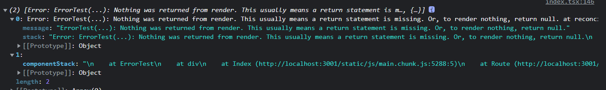

#### 懒加载和异步渲染

##### 异步渲染

- Suspense是用同步的代码来实现异步操作的方案：组件等待异步操作，结束后进行组件的渲染
- fallback属性用来代替处于loading状态下渲染的内容 案例1

##### 动态加载（懒加载）

- 配合React.lazy实现动态加载
- React.lazy接受一个动态调用`import()`的函数，必须返回Promise，且该Promise需要resolve一个default export的React组件 案例2
- React.lazy动态引入test.js组件，配合Suspence实现动态加载组件效果，**利于代码分割，初始化不会加载大量文件**

##### React.lazy和Suspense实现动态加载原理

Suspense异步组件情况下允许**调用Render => 发送异步请求 -> 悬停，等待异步请求完成 -> 再次渲染展示数据**

###### Suspense原理

内部通过`try{}catch{}`捕获`Promise`异常，在这个Promise中进行数据请求，Suspense内部捕获到Promise终止渲染，Promise结束后再重新render将数据渲染出来，达到异步渲染效果

###### React.lazy原理

React.lazy内部模拟一次Promise请求过程，请求结果不是数据而是组件，下一次渲染就直接渲染这个组件
所以React.lazy利用Suspense接收Promise，执行Promise，然后再渲染这个特性做到动态加载

```javascript
// react/src/ReactLazy.js
function lazy(ctor) {
  return {
    $$typeof: REACT_LAZY_TYPE,
    _payload: {
      _status: -1, //初始化状态
      _result: ctor,
    },
    _init: function (payload) {
      if (payload._status === -1) {
        /* 第一次执行会走这里  */
        const ctor = payload._result;
        const thenable = ctor();
        payload._status = Pending;
        payload._result = thenable;
        thenable.then((moduleObject) => {
          const defaultExport = moduleObject.default;
          resolved._status = Resolved; // 1 成功状态
          resolved._result =
            defaultExport; /* defaultExport 为我们动态加载的组件本身  */
        });
      }
      if (payload._status === Resolved) {
        // 成功状态
        return payload._result;
      } else {
        //第一次会抛出Promise异常给Suspense
        throw payload._result;
      }
    },
  };
}
```

- React.lazy包裹的组件会标记`REACT_LAZY_TYPE`类型的element，调和阶段变成LazyComponent类型的fiber
- React对LazyComponent处理逻辑：
  1. 第一次渲染执行init方法，得到一个Promise，成功回调就是将要渲染的组件defaultExport
  2. 走第二个if判断，此时状态不是Resolved，走else，抛出异常，使当前渲染终止
  3. 异常Promise被Suspense捕获，当执行成功回调后得到想要渲染的组件
  4. Suspense发起二次渲染，此时init方法已经使Resolves状态，直接返回result也就是真正渲染的组件

##### 渲染错误边界

- React组件渲染环节只要一个环节出现问题，就会导致整个组件渲染失败，UI层无法展示就会导致白屏
- 为防止渲染异常，React新增生命周期componentDidCatch 和 static getDerivedStateFromError()，用于挽救渲染阶段出现问题而导致UI界面无法显示的问题  案例4
  - componentDidCatch
两个参数：error——抛出的错误；info——带有componentStack key的对象，其中包含有关组件引发错误的栈信息

  - getDerivedStateFromError
react希望使用getDerivedStateFromError代替componentDidCatch处理渲染异常情况。内部不能调用setState，但返回值可以合并到state作为渲染使用

#### key的合理使用

首先React在一次更新中发现render后的children是一个数组时，调用reconcilerChildrenArray来调和子代fiber

##### diff children流程

1. 遍历新children，复用oldFiber

   ```javascript
   // react-reconciler/src/ReactChildFiber.js
   function reconcileChildrenArray(){
     /* 第一步  */
     for (; oldFiber !== null && newIdx < newChildren.length; newIdx++) {  
         if (oldFiber.index > newIdx) {
             nextOldFiber = oldFiber;
             oldFiber = null;
         } else {
             nextOldFiber = oldFiber.sibling;
         }
         const newFiber = updateSlot(returnFiber,oldFiber,newChildren[newIdx],expirationTime,);
         if (newFiber === null) { break }
         // ..一些其他逻辑
         }  
         if (shouldTrackSideEffects) {  // shouldTrackSideEffects 为更新流程。
             if (oldFiber && newFiber.alternate === null) { /* 找到了与新节点对应的fiber，但是不能复用，那么直接删除老节点 */
                 deleteChild(returnFiber, oldFiber);
             }
         }
     }
   }
   ```

   - 遍历新child数组，找到与child对应的oldFiber
   - 调用updateSlot，判断当前tag和key是否匹配，匹配则直接复用老fiber，不匹配返回null，此时newFiber等于null
   - 如果处于更新流程，找到与新节点对应的老fiber，但是不能复用`alternate === null`则删除老fiber
2. 统一删除oldfiber

   ```javascript
   if (newInx === newChildren.length) {
     deleteRemainingChildren(returnFiber, oldFiber);
     return resultingFirstChild;
   }
   ```

    新节点遍历完成，剩下的oldFiber统一删除

3. 统一创建newFiber

   ```javascript
    if(oldFiber === null){
      for (; newIdx < newChildren.length; newIdx++) {
          const newFiber = createChild(returnFiber,newChildren[newIdx],expirationTime,)
          // ...
      }
    }
   ```

   oldFiber复用完，如果还有新的children，说明都是新元素，调用createChild创建新的fiber
4. 针对位移和更复杂的情况

   ```javascript
   const existingChildren = mapRemainingChildren(returnFiber, oldFiber);
   for (; newIdx < newChildren.length; newIdx++) {
     const newFiber = updateFromMap(existingChildren,returnFiber)
     /* 从mapRemainingChildren删掉已经复用oldFiber */
   }
   ```

   - mapRemainingChildren存放剩余老fiber和对应的key的映射关系
   - 遍历剩余没有处理的children，通过updateFromMap，判断mapRemainingChildren中有无可以复用oldFiber，有则复用没有则创建一个newFiber
5. 删除剩余没有复用的fiber

   ```js
   if (shouldTrackSideEffects) {
     /* 移除没有复用到的oldFiber */
     existingChildren.forEach(child => deleteChild(returnFiber, child));
   }
   ```

   遍历完成，没有复用的节点被统一删除

##### diff思考

1. React使用这一些列手段将时间复杂度从O(n^3)降低到O(n)
2. 不要使用index或者index拼接其他字段作为key，如果元素发生移动，则从被移动元素开始后面的元素都不能被合理的复用